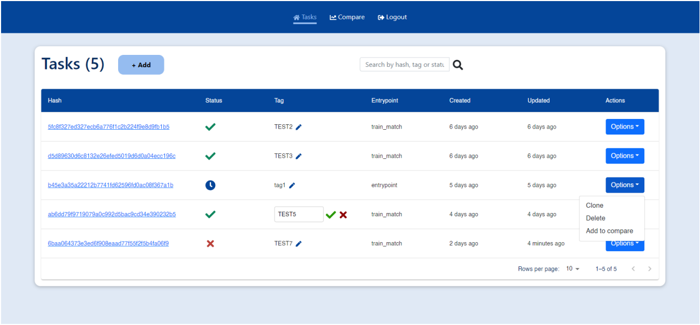
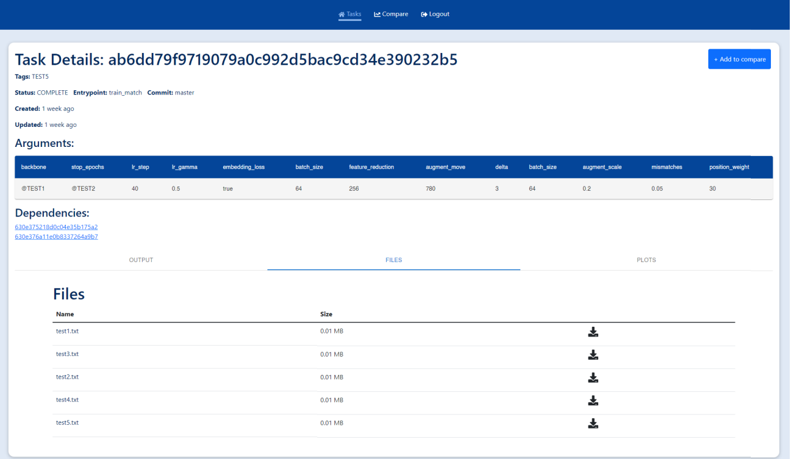
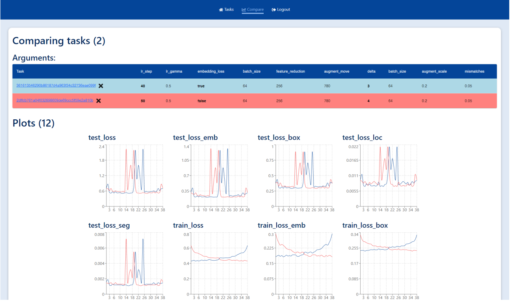
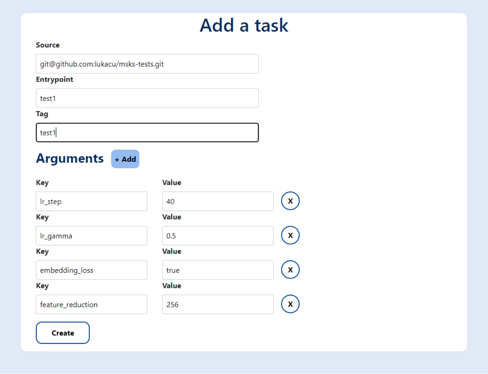

# Msks-box

This project is my diploma thesis. It was built in MERN stack - MongoDB, ExpressJS, ReactJS, NodeJS.

## Summary

Msks-box is a system for tracking results machine learning experiments. It supports uploading files and logs of experiments, user authentication, plotting graphs,
comparing multiple experiments, linking experiments into dependencies.

## Frontend

Frontend of the application is implemented as a Single Page Application (SPA). I chose ReactJS for frontend because of it's minimalistic implementation and it's rich ecosystem of external libraries. Main libraries are React Bootstrap,
MUI, Redux Toolkit.

## Backend

Backend is implemented with NodeJS and ExpressJS. It supports all CRUD operations, authentication with JWT, locking of experiments, file upload etc.

## Demo images

